# Projeto de Análise Empírica de algoritmos de busca
Disciplina: Estrutura de Dados Básicas I, Universidade Federal do Rio Grande do Norte ([UFRN](http://http://www.ufrn.br))

#### Aluno
- [José Eduardo Bezerra de Medeiros](https://github.com/dudubezerra)

### Sumário

+ [Introdução](#introdução)
  + [Mas o que são algoritmos de busca?](#mas-o-que-são-algoritmos-de-busca)
+ [Metodologia](#metodologia)
  + [Material](#material)
  + [Princípios](#princípios)
+ [Instruções de uso](#instruções-de-uso)
  + [Dependências](#dependências)
    + [gnuplot](#gnuplot)
    + [G++ Compiler](#g-compiler)
  + [Compilando](#compilando)
  + [Executando](#executando)
  + [Plotando Gráficos](#plotando-gráficos)
+ [Apresentação dos Algoritmos](#apresentação-dos-algoritmos)
  + [Busca linear](#busca-linear)
  + [Busca binária Iterativa](#busca-binária-iterativa)  
  + [Busca binária recursiva](#busca-binária-recursiva)
  + [Buca ternária Iterativa](#busca-ternária-iterativa)
  + [Busca ternária recursiva](#busca-ternária-recursiva)
  + [Busca por pulo](#busca-por-pulo)
  + [Busca fibonacci](#busca-fibonacci)
+ [Cenários de Simulação](#cenários-de-simulação)
 + [Algoritmos lineares](#algoritmos-lineares)
 + [Recursão vs Iteração](#recursão-vs-iteração)
 + [Tamanho da partição e desempenho](#tamanho-da-partição-e-desempenho)
 + [Algoritmos de Classes de complexidade diferentes](#algoritmos-de-classes-de-complexidade-diferentes)
 + [O pior caso da busca fibonacci](#O-pior-caso-da-busca-fibonacci)

## Introdução


  Este projeto tem como objetivo comparar algoritmos de busca por meio de análise empírica e determinar como configurações de entrada afetam o desempenho de cada algoritmo. 
### Mas o que são algoritmos de busca?
  Algoritmos de busca são aqueles projetados para resolver o problema da **busca em um arranjo sequencial**, que pode ser definida como:
```
Dado um conjunto de valores previamente armazenados em um arranjo A, nas
posições A[l], A[l + 1], . . . , A[r], sendo 0 ≤ l ≤ r ∈ N 0 , verificar se um valor chave
k está entre este conjunto de valores. Em caso positivo indicar qual o ı́ndice da
localização de k em A, caso contrário retornar −1.
```
  No caso do nosso projeto os arranjos serão inicializados em todas as posição com o valor 0, e por padrão procuraremos o valor 1 nesse arranjo, pois queremos sempre analisar o **pior caso** de cada algoritmo.

## Metodologia
### Material 
  Essa é a caracterização técnica do computador utilizado para realizar os teste desse projeto:
+ **Notebook** : Dell inspiron 5557
+ **Processador** : Intel(R) Core(TM) i7-6500U CPU @ 2.50GHz
+ **Memória** : 8GB Single Channel DDR3 1600MHz 
+ **Sistema** : Linux Mint 18.3 Sylvia
### Princípios
   Todo o projeto foi implementado em **C++**, documentado com comentários **Doxygen**, utilizei **G++**, para compilar e **gnuplot** para gerar gráficos. 
   Foram implementados os algoritmos de **busca linear**, **busca binária**, **busca binária recursiva**, **busca ternária**, **busca ternária recursiva**, **busca por pulo** e **busca fibonacci**. Os algoritmos se utilizam do conceito de ranges, tendo como parâmetros iteradores 'first e last', que definem o começo  e o fim do espaço no vetor em que a busca deve ser realizada.
   Foram feitos testes em arranjos pequenos de 10 posições, para verificar a funcionalidade de cada algoritmos. Após isso eles foram submetidos a testes com arranjos maiores, com tamanho máximo de 400.000.000 (Quatrocentos milhões) de elementos, ( devido às limitações do meu sistema).
   Para a medição de tempo foram utilizadas funções provindas da biblioteca **<chrono>**, que foram gravadas em arquivos *.txt* na pasta */Data* deste projeto.
   As informações desses arquivos *.txt* foram utilizados para gerar gráficos de Tempo de execução x Tamanho da amostra, por meio da ferramenta **gnuplot**. Ambos se caracterizando como exemplos empirícos da funcionalidade de cada algoritmo.
   Após a obtenção dos dados eles foram utilizados para comparar cada algoritmo com o objetivo de poder gerar um relatório de conclusões.

## Instruções de uso


### Dependências
##### gnuplot
É necessário para gerar os gráficos por meio do script de plotagem, porém não é estritamente obrigatório, fica a critério do usuário optar por utilizar qualquer outra ferramenta que gere gráficos a partir de pontos 2D.
```bash
# Para instalar o Gnuplot no Ubuntu, Linux Mint, Elementary OS e derivados, execute:
$ sudo apt-get install gnuplot
```
##### G++ Compiler
É necessário para a compilação do programa, pois todo o projeto foi implementado em C++.
```bash
# Como instalar no Ubuntu 16.04 LTS por exemplo:
sudo apt-get install g++
```

### Compilando 
Para compilar o projeto você deve utilizar o seguinte comando no diretório raíz:
```bash
# Somente compilar
g++ -Wall -std=c++14 src/main.cpp src/search.cpp -o bin/run

# Compilar e excutar com parametros pré-definidos
chmod 755 exec.sh
./exec.sh
```
### Executando

Para executar programa com parâmetros via linha de comando deve ser seguida a seguinte estrutura no diretório raíz:
```bash
./bin/run {Tamanho final do arranjo} {Número do algoritmo que deseja executar}
```
+ Tamanho final do arranjo
   O tamanho final do arranjo deve ser um inteiro entre [1000,400000000], pois o número de amostras que estipulei para gerar um gráfico visualmente aceitável, e que não demorassem muito tempo para serem escritas num arquivo foi de 1000. E 400000000 devido a limitação do meu sistema em alocar um vetor dinamicamente sem retornar um erro de *bad_alloc*.
   Caso o tamanho final do arranjo seja menor que mil ou maior que 400000000, o cliente receberá uma menssagem de erro e o programa não fará as buscas.
+ Número do algoritmo que deseja executar 
   O número do algoritmo que deseja executar deve ser um inteiro entre [1,7], pois como o projeto se dispõe de 7 algoritmos, cada numéro representa um deles.
   + 1 = Busca linear.
     2 = Busca Binária iterativa.
     3 = Busca Binária Recursiva.
     4 = Busca Ternária iterativa.
     5 = Busca Ternária Recursiva.
     6 = Jump Search.
     7 = Busca fibonacci.
+ Defaults
   Caso o cliente não forneça nenhum parâmetro por linha de comando o programa executará todos os algoritmos num vetor no seu tamanho máximo;
   Caso o cliente ofereça apenas o tamanho final do arranjo o programa executará todos os algoritmos com o tamnho final fornecido.
+ Algumas possiveis entradas de execução em linha de comando:
```bash
      #Execução default
      ./bin/run
 
      #Execução default passando apenas o tamanho final
      ./bin/run 1000
  
      #Execução da busca linear com 2000 elementos
      ./bin/run 2000 1
 ![Linear] (.Plots/Linearsearch_plot.pdf)
      #Execução de várias buscas com 5000 elementos
      ./bin/run 5000 1 2 3 4 5
```

### Plotando gráficos
   Para plotar os gráficos basta executar o seguinter código na pasta raíz do projeto:
```bash
gnuplot < script.gnu
```
   Esse comando irá atualizar os gráficos de todos os algoritmos na pasta Plots.


## Apresentação dos algoritmos
### Busca linear
   É um algoritmo de busca que pesquisa no vetor de modo sequencial, elemento por elemento (no nosso casa da esquerda para a direita), de modo que a função do tempo em relação ao número de elementos seja linear num ambiente de testes ideal.

#### Implementação


```c++
itr lsearch( itr first, itr last, value_type value ){

   itr fast = first;

   while ( fast < last){
      if ( *fast == value){
         return fast;
      }
      fast++;
   }

   return last;
}

```

#### Gráfico

   Esse gráfico mostra o tempo de milissegundos que o algoritmo levou para ser executado versus o tamanho do vetor em que a busca iterou.O gráfico gerado com coletando mil amostras de tempo com a busca linear sobre um vetor máximo de 400.000.000 elementos. Podemos observar alguns picos devido o sistema cuidar de outros processos enquanto faz a medição.

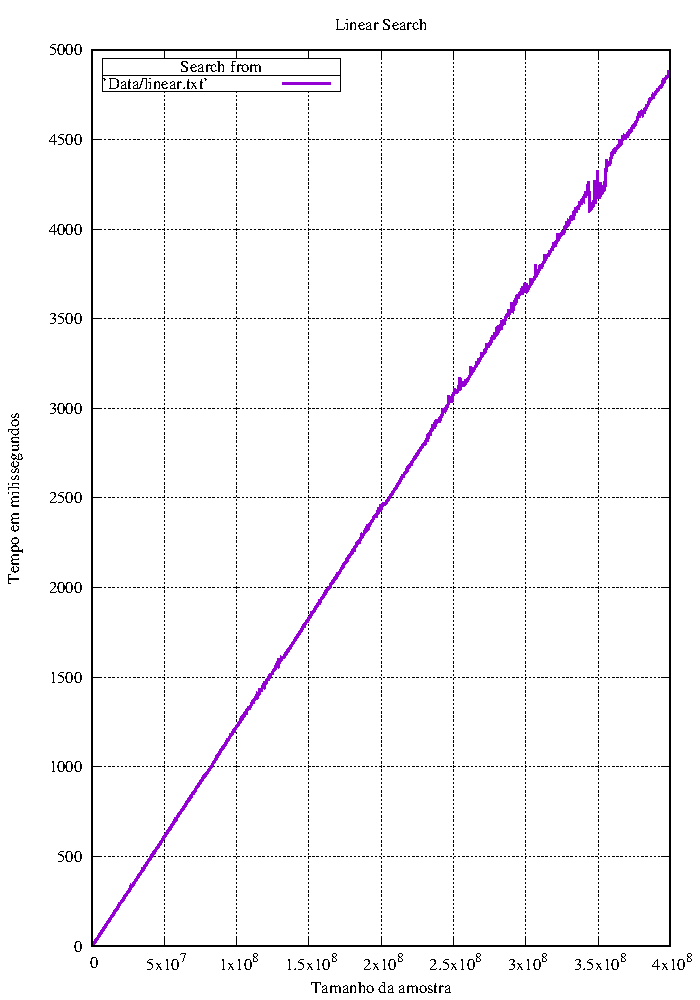

### Busca binária Iterativa

  É um algoritmo de busca que segue o paradigma de divisão e conquista. Ele compara o elemento que estamos buscando com o elemento do meio do vetor. 

  Se o elemento do meio do vetor for igual ao que estamos procurando a busca termina com sucesso. Caso o elemento do meio seja menor, ele faz a busca na metade posterior do vetor e caso o elemento seja maior, ele faz a busca na metade anterior do vetor.

#### Implementação

```c++
itr bsearch ( itr first, itr last, value_type value ){

   itr left = first;
   itr right = last-1;
   itr middle;


   while ( left <= right ){


      middle = left+(right-left)/2;
      if ( *middle == value){
         return middle;
      }
      else if ( value < *middle ){
         right = middle-1;
      }
      else if ( value > *middle){
         left = middle+1;
      }

   }

    return last; 
}
```

#### Gráfico

   Esse gráfico mostra o tempo de milissegundos que o algoritmo levou para ser executado versus o tamanho do vetor em que a busca iterou.O gráfico gerado com coletando mil amostras de tempo com a busca binária sobre um vetor máximo de 400.000.000 elementos. Podemos observar alguns picos devido o sistema cuidar de outros processos enquanto faz a medição.

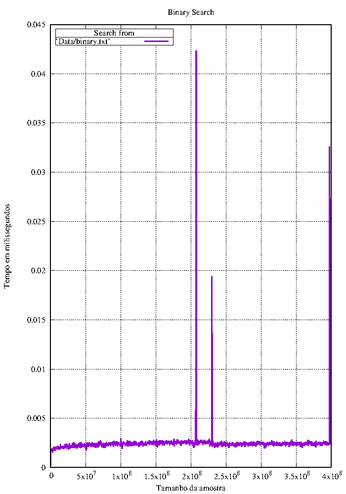

#### Busca binária recursiva

  É um algoritmo de busca que segue o paradigma de divisão e conquista. Ele compara o elemento que estamos buscando com o elemento do meio do vetor.

   Se o elemento do meio do vetor for igual ao que estamos procurando a busca termina com sucesso. Caso o elemento do meio seja menor ele utiliza uma chamada da própria função de busca binária para fazer a busca na metade posterior do vetor, e caso o elemento seja maior, a chamada da função de busca binária na metade anterior do vetor.

#### Implementação

```c++
itr bsearch_r ( itr first, itr last, value_type value ){


   itr temporary;
   itr middle;


      middle = first+(last-first)/2;

      if ( first > last ) {  // Break if the value is not in the range
         return last;
      }
      else if ( *middle == value){
         return middle;
      }
      else if ( value < *middle ){

        temporary = bsearch_r ( first, middle-1, value);
        if ( *temporary == value ) { // If statement to update the pointer that 
                                     //will be returned at the final of recursion
           return temporary;
        }
        else {
           return last;
        }

      }
      else if ( value > *middle){
         temporary = bsearch_r ( middle+1, last, value);
        if ( *temporary == value ) {
           return temporary;
        }
        else {
           return last;
        }
      }

      return last; 

}

```


#### Gráfico 

   Esse gráfico mostra o tempo de milissegundos que o algoritmo levou para ser executado versus o tamanho do vetor em que a busca iterou.O gráfico gerado com coletando mil amostras de tempo com a busca binária recursiva sobre um vetor máximo de 400.000.000 elementos. Podemos observar alguns picos devido o sistema cuidar de outros processos enquanto faz a medição.

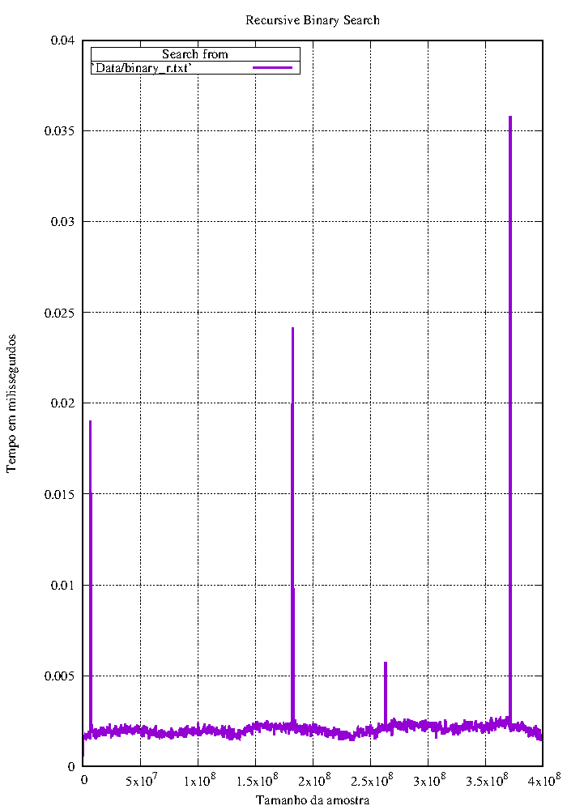


### Busca Ternária iterativa

   É um algoritmo de busca que segue o paradigma de divisão e conquista. Ele é similar à busca binária, porém nesse caso dividimos nosso vetor em 3 partes em oposição a dividir em 2. 

  Ele compara o elemento que estamos buscando com o elemento que está no na posição equivalente a 1/3 do tamanho do vetor e também compara o elemento procurado com o elemento da posição equivalente a 2/3 do tamanho do vetor.

   Caso o elemento seja menor que o primeiro comparado, ele faz a busca no primeiro terço do vetor. Caso o elemento esteja entre o primeiro a ser comparado e o segundo ele faz a busca no segundo terço do vetor. Caso ele seja maior que o segundo elemento a ser comparado ele faz a busca no terceiro vetor. E caso ele seja igual a um dos dois a busca é terminada com sucesso.

#### Implementação

```c++
itr tsearch ( itr first, itr last, value_type value ){

   itr left = first;
   itr right = last-1;
   itr middle1;
   itr middle2;


   while ( left <= right ){


      middle1 = left+(right-left)/3;
      middle2 = right-(right-left)/3;

      if ( *middle1 == value){
         return middle1;
      }
      else if ( *middle2 == value){
         return middle2;
      }
      else if ( value < *middle1 ){
         right = middle1-1;
      }
      else if ( value > *middle1 && value < *middle2){
         left = middle1+1;
         right = middle2-1;
      }
      else {
         left = middle2+1;
      }

   }

    return last; 
}


```

#### Gráfico

   Esse gráfico mostra o tempo de milissegundos que o algoritmo levou para ser executado versus o tamanho do vetor em que a busca iterou.O gráfico gerado com coletando mil amostras de tempo com a busca ternária sobre um vetor máximo de 400.000.000 elementos. Podemos observar alguns picos devido o sistema cuidar de outros processos enquanto faz a medição.

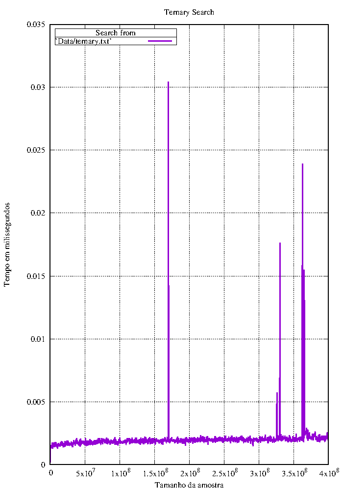

### Busca ternária Recursiva

  É um algoritmo de busca que segue o paradigma de divisão e conquista. Ele é similar à busca binária recursiva, porém nesse caso dividimos nosso vetor em 3 partes em oposição a dividir em 2.

   Ele compara o elemento que estamos buscando com o elemento que está no na posição equivalente a 1/3 do tamanho do vetor e também compara o elemento procurado com o elemento da posição equivalente a 2/3 do tamanho do vetor.

   Caso o elemento seja menor que o primeiro comparado, ele faz a busca no primeiro terço do vetor, utilizando uma chamada recursiva da própria função de busca ternária. Caso o elemento esteja entre o primeiro a ser comparado e o segundo ele faz a busca no segundo terço do vetor,utilizando uma chamada recursiva da própria função de busca ternária. Caso ele seja maior que o segundo elemento a ser comparado ele faz a busca no terceiro veto,r, utilizando uma chamada recursiva da própria função de busca ternária. E caso ele seja igual a um dos dois a busca é terminada com sucesso.

#### Implementação

```c++
      
itr tsearch_r ( itr first, itr last, value_type value ){

   itr temporary;
   itr middle1;
   itr middle2;


      middle1 = first+(last-first)/3;
      middle2 = last-(last-first)/3;


      if ( first > last ){
         return last;
      }
      if ( *middle1 == value){
         return middle1;
      }
      else if ( *middle2 == value){
         return middle2;
      }
      else if ( value < *middle1 ){
         temporary = tsearch_r ( first, middle1-1, value );
         if ( *temporary == value ){
            return temporary;
         }
         else {
            return last;
         }
      }
      else if ( value > *middle1 && value < *middle2){
         temporary = tsearch_r ( middle1+1, middle2-1, value );
         if ( *temporary == value ){
            return temporary;
         }
         else {
            return last;
         }
      }
      else {
         temporary = tsearch_r ( middle2+2, last, value ) ;
         if ( *temporary == value ){
            return temporary;
         }
         else {
            return last;
         }
      }

      return last; 
}
```


#### Gráfico 

   Esse gráfico mostra o tempo de milissegundos que o algoritmo levou para ser executado versus o tamanho do vetor em que a busca iterou.O gráfico gerado com coletando mil amostras de tempo com a busca ternária recursiva sobre um vetor máximo de 400.000.000 elementos. Podemos observar alguns picos devido o sistema cuidar de outros processos enquanto faz a medição.


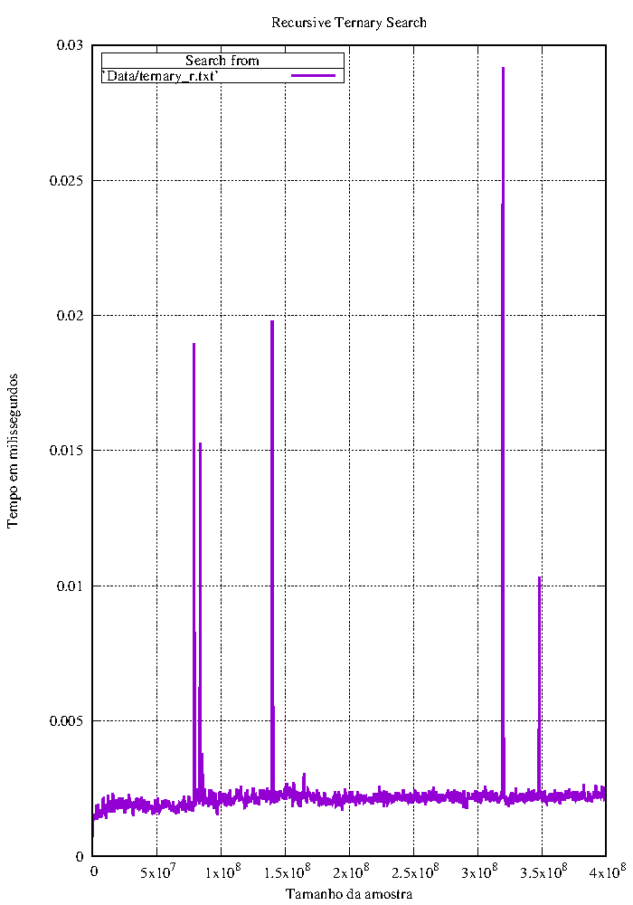

### Busca por pulo

   A busca por pulo (Jump Search), é um algoritmo que lembro a busca linear, mas sua ideia é checar menos elementos pulando alguns deles de acordo com um tamanho pré-defino, que costuma ser a raíz do tamanho do arranjo que está a ser utilizado.

  O algoritmo testa executa o pulo até encontrar um elemento maior ou igual ao elemento a ser procurado. Caso o elemento seja maior é feita uma busca linear entre o penúltimo elemento checado e o último. Caso o elemento seja igual ao elemento referente a posição do pulo, a busca é terminada com sucesso.

#### Implementação

```c++
itr jsearch ( itr first, itr last, value_type value ){

   const value_type dis = std::distance (first, last);
   const value_type jump = sqrt(dis);


      for ( int aux = 0; (aux * jump) < dis; aux++ ){
         itr left = first + ( (aux-1)*jump );
         itr right = first + ( (aux)*jump );

         if ( value == *right ){
            return right;
         }
         else if ( aux > 0){
            if ( value > *left && value < *right ){
              return lsearch ( left+1, right-1, value);
            }
         }
      }
      return last; 
}
```

#### Gráfico

   Esse gráfico mostra o tempo de milissegundos que o algoritmo levou para ser executado versus o tamanho do vetor em que a busca iterou.O gráfico gerado com coletando mil amostras de tempo com a busca por pulo sobre um vetor máximo de 400.000.000 elementos. Podemos observar alguns picos devido o sistema cuidar de outros processos enquanto faz a medição.

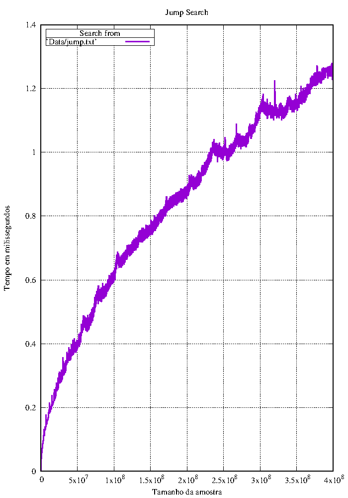

  #### Busca fibonacci

   A busca fibonacci é um algoritmo do paradigma de divisão e conquista. Ele se utiliza dos número de fibonacci para fazer a divisão do arranjo. O algoritmo primeiramente busca pelo menor número de fibonacci maior ou igual ao tamanho do arranjo. Feito isso, ele volta dois números para esquerda na sequencia de fibonacci e o utiliza como endereço de uma posição no arranjo, caso seja válido. Comparamos esse o conteúdo desse endereço com o valor que procuramos, caso sejam iguais a busca termina com sucesso, caso o valor que procuramos seja maior, a busca é feita num arranjo dividido pelos números de fibonacci 1 casa à esquerda com parte da esquerda do arranjo já eliminada, caso o valor que procuramos seja menor, a busca é feita num arranjo dividido pelos números de fibonacci duas casas à esquerda.  

#### Implementação 

```c++
itr fsearch ( itr first, itr last, value_type value ){

//===== Auxiliary Variables
   int dis = std::distance (first,last);

//===== Iterator
    int fib0 = 0;
    int fib1 = 1;
    int fibR = fib0+fib1;

//===== Scope

   while ( fibR < dis ) { // While to find the smallest fibonacci number greater than the size of the range.
      fib0 = fib1;
      fib1 = fibR;
      fibR = fib0+fib1; 
     
   }
  
   int offset = -1; // Eliminate the uselles part of the range

   while ( fibR > 1 ) { // FibR > 0 because if becomes 1 Fib0 becomes 0;
     
      //                  Check if fib0 is in the range
      itr index = min ( first+fib0+offset , last-1 );
     
      if ( value > *index ){ // Moving 1 fibonacci down and reseting the offset to eliminate the front of the array
         fibR = fib1;
         fib1 = fib0;
         fib0 = fibR - fib1;
         offset = std::distance (first,index);
      }
      else if ( value < *index ){ // Moving 2 fibonacci down
         fibR = fib0;
         fib1 = fib1-fib0;
         fib0 = fibR -fib1;
      }
      else if( value == *index ){
         return index;
      }

   }

   if ( fib1 && (*first+offset+1) == value ) return first+offset+1;

      return last; 
}
```


#### Gráfico

   Esse gráfico mostra o tempo de milissegundos que o algoritmo levou para ser executado versus o tamanho do vetor em que a busca iterou.O gráfico gerado com coletando mil amostras de tempo com a busca fibonacci sobre um vetor máximo de 400.000.000 elementos. Podemos observar alguns picos devido o sistema cuidar de outros processos enquanto faz a medição.

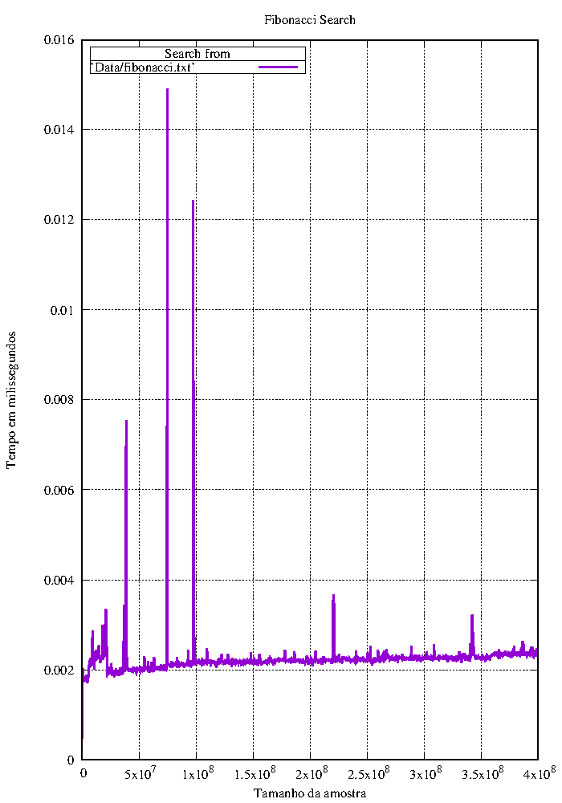

### Cenários de simulação

   A simulação foi realizada sobre um **std::vector** de tamanho máximo 400.000.000 (Quatrocentos milhões) com todos os elementos inicializados com 0. O cenário ideal seria alocar um vetor com elementos distribuídos em ordem crescente, para ser mais fiel ao problema computacional, porém. a inicialização não gera impactos significativos nos dados gerados, como o programa procura o número 1, por default, os algoritmos sempre serão "deslocados" para a direita, pois 1 sempre será maior que 0.

  Como queremos avaliar o comportamento assintótico dos algoritmos em relação ao seu tempo de execução, foi estabelecido que para cada simulação serão gerados um total de 1000 amostras, por isso o tamanho do vetor mínimo alocado é igual a 1000. De acordo com o tamanho do vetor é estabelecido o tamanho das mil amostras que serão geradas de acordo com a formula **(Tamanho-máximo do vetor/1000) = incremento de tamanho nos subvetores**, por exempo: 

- caso o tamanho máximo do vetor seja 1000, serão feitos mil testes em vetores de tamanho {0, 1, 2, 3, 4, 5,  ... , 999};
- caso o tamanho máximo do vetor seja 50000, serão feitos mil teste em vetores de tamanho {0, 50, 100, 150, 200,  ... ,  49950}.


### Algoritmos lineares 

> "Considerando os dois algoritmos lineares, **busca linear** e **busca por pulo**, qual é o mais eficiente no pior caso?"

##### Gráficos específicos:

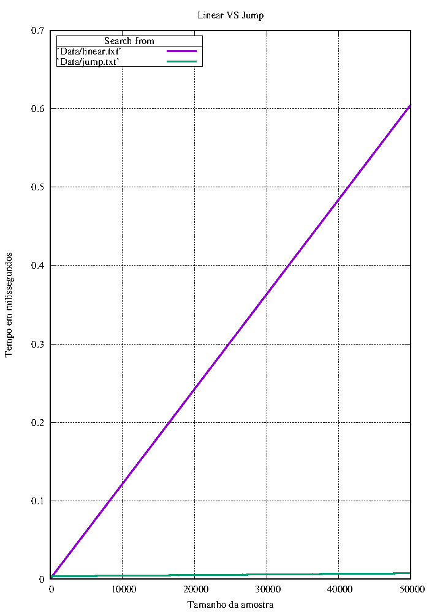

​		(No gráfico acima foi utilizado um suavizador de linhas para ajudar na visualização)

#### Conclusão

   Podemos observar que a busca **Busca por pulo** é mais eficiente em seu pior caso, existe uma diferença gritante entre o tempo de execução dos dois algoritmos. 

   Se comparamos os gráficos vemos que o tempo de execução do **Busca por pulo** entre entre aproximadamente [0 e 1.5] milissegundos. Já a **Busca linear** está entre [0 e 5000] milissegundos. O que está de acordo com a complexidade de cada algoritmo, pois a busca linear tem complexidade **O(n)** e a busca por pulo tem complexidade **O(sqrt(n))**, (Note que sqrt é uma função que retorna a raíz de n).


### Recursão vs Iteração

   "Qual tipo de estratégia de implementação é mais eficiente, **recursão ou iteração**?”


#### Gráficos específicos

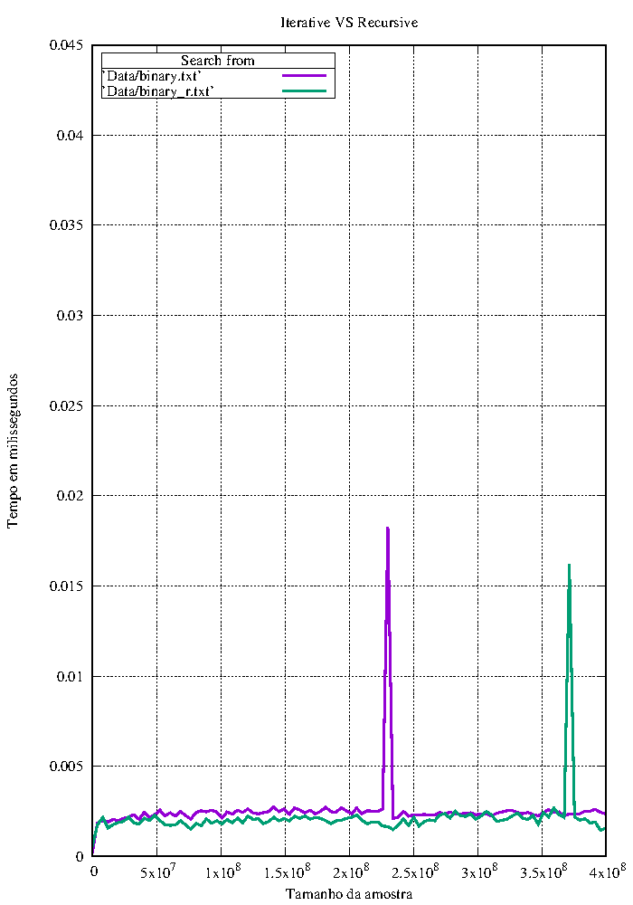

​		(No gráfico acima foi utilizado um suavizador de linhas para ajudar na visualização)

##### Conclusão 

   É esperado que a busca recursiva leve mais tempo para ser executada, porém como vimos nos gráficos acima, as buscas tiveram desempenho bastante parecido. Como a execução de tempo varia de acordo com processos do sistema que estão sendo executados no momento da medição os gráficos são plausíveis. Assim não é possível definir qual o algoritmo mais eficiente em um caso geral, pois os resultados podem variar de acordo com o do cenário de testes. 

### Tamanho da partição e desempenho

   "De que forma o tamanho da partição pode influenciar o desempenho dem uma estratégia de busca por divisão e conquista?"

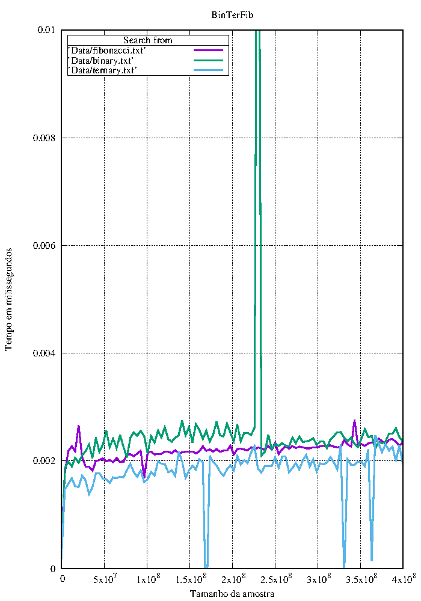

​		(No gráfico acima foi utilizado um suavizador de linhas para ajudar na visualização)

#### Conclusão

​     Os três algoritmos partem o vetor em diferentes tamanhos. A busca binária divide sempre em 2, a busca ternária divide sempre em 3 e a busca fibonacci divide de acordo com os números de fibonacci. Queremos analisar se quanto maior a divisão mais rápido será o algoritmo, tendo em vista que mais elementos serão descartados.

​    Podemos analisar que a busca binária ficou um pouco acima das outras duas buscas, apesar dela ter complexidade **O(log n)**, enquanto a busca ternária e a busca fibonacci tiveram um desempenho mais semelhante. 

   Como temos tempos muito próximos um do outro, é plausível concluir que o número de partições tem grande influência na execução dos algoritmos, ainda quanto mais dividirmos os vetor, mais passos serão feitos em cada iteração, o que pode ser custoso para algumas máquinas.

### Algoritmos de Classes de complexidade diferentes

  “A partir de que momento algoritmos de classes de complexidade diferentes começam
a se diferenciar?”

#### Gráfico


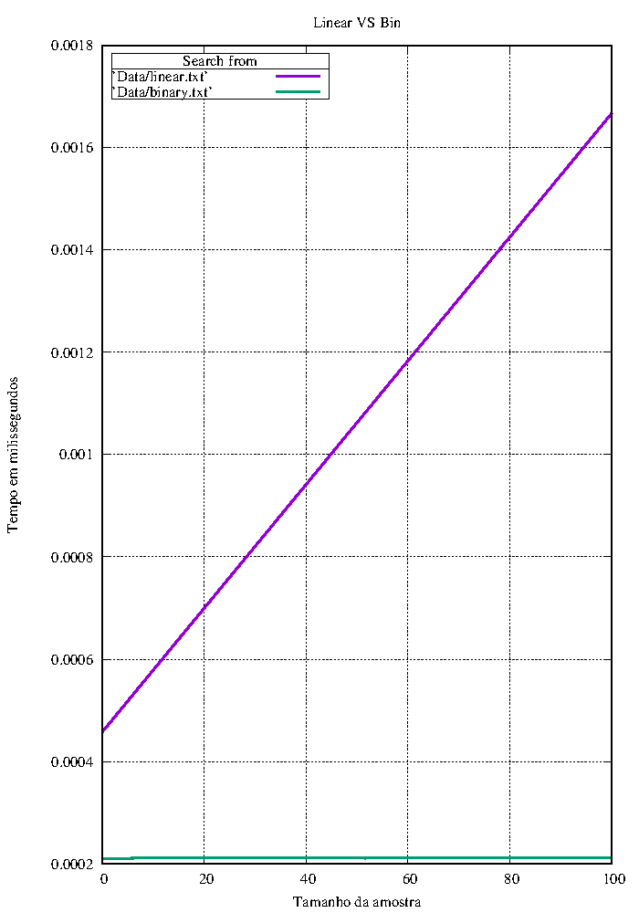

#### Conclusão

   As busca de complexidade diferentes tem diferenças gritantes em seu desempenho, como observado no gráfico.

   A partir de aproximadamente 15 elementos as buscas começas a divergir, enquanto a linear só tende a subir, a binária a ser próxima de uma linha constante.
   
   ### O pior caso da busca fibonacci

 	“Existem categorias diferentes de pior caso para a busca Fibonacci?”

##### Gráficos 


   

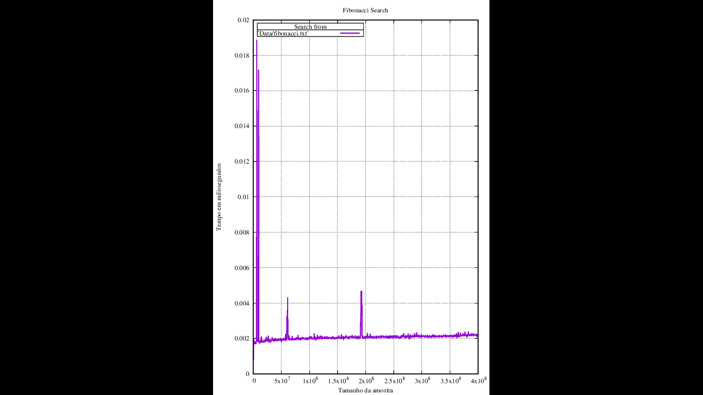

#### Conclusão 

​    No primeiro caso procuramos por um número à direita do arranjo e no segundo procuramos por um número à esquerda. Podemos observar que quando procuramos números à esquerda em arranjos pequenos, levamos mais tempo do que o esperado com a busca fibonacci.

